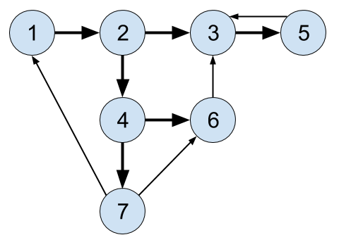

# Breadth First Search (BFS)

## Objective

* Learn about one of the more famous graph algorithms
* Learn uses of BFS

## Overview

When searching a graph, one of the approaches is called _breadth first
search_. This explores the graph outward in rings of ever increasing
distance from the starting vertex. 

The algorithm never attempts to explore a vert that it either has
explored or is exploring.

For example, when starting from the upper left, the numbers on this
graph show a vertex visitation order in a BFS:



The bold lines show with edges were followed. (The thin edges were not
followed since their destination nodes had already been visited.)

(Of course, the exact order will vary depending on which branches get
taken first and which vertex is the starting vertex.)

## Uses of BFS

* Pathfinding, Routing 
* Find neighbor nodes in a P2P network like Bittorrent 
* Web crawlers 
* Finding people n connections away on a social site 
* Find neighboring locations on graph 
* Broadcasting in a network 
* Cycle detection in a graph 
* Finding [Connected Components](https://en.wikipedia.org/wiki/Connected_component_(graph_theory))
* Solving a number of theoretical graph problems 

## Coloring Vertexes

As the graph is explored, it's useful to color verts as you arrive at
them and as you leave them behind as "already searched".

Commonly, unvisited verts are white, verts whose neighbors are being
explored are gray, and verts with no unexplored neighbors are black.


## Keeping Track of What We Need to Explore

In BFS, it's useful to track which nodes we need to follow up on. For
example, in the diagram above, when we get to node 2, we need to explore
node 3 and 4 in the future, in order.

We can track that by adding neighbors to a _queue_, and then exploring
the verts in the queue.


## Pseudocode for BFS

```pseudocode
BFS(graph, startVert):
  for v of graph.vertexes:
    v.color = white

  startVert.color = gray
  queue.enqueue(startVert)

  while !queue.isEmpty():
    u = queue[0]  // Peek at head of queue, but do not dequeue!

    for v of u.neighbors:
      if v.color == white:
        v.color = gray
        queue.enqueue(v)
    
    queue.dequeue()
    u.color = black
```

## Exercises

* Build a random graph and show a vertex visitation order for BFS.

* One more for good measure
