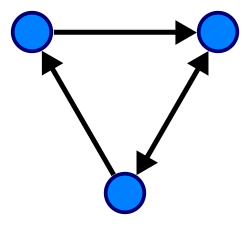

# Intro to Graphs

## Objectives

* Learn what graphs are
* Learn the components of graphs
* Learn what graphs are useful for

## What Are Graphs?

Graphs are collections of related data. They're like trees, except
connections can be made from any node to any other node, even forming
loops.

The nodes in a graph are called _vertexes_ (or _vertices_ or _verts_),
and the connections between the verts are called _edges_.

And edge denotes a relationship or linkage between the two verts.

## What can they represent?

Graphs can represent any kind of multiway relational data.

This could be a collection of cities and linking roads.

It could be a collection of computers on a network.

It could be a population of people know know each other and [Kevin
Bacon](https://en.wikipedia.org/wiki/Six_Degrees_of_Kevin_Bacon).

It could represent trade relationships between nations.

And so on.

## Definitions

### Directed/Undirected Graphs

If the edges are "one way" (have an arrow), the graph is said to be a
_directed graph_. If there are no arrows, the edges are bidirectional
and the graph is an _undirected_ graph.

### Cyclic/Acyclic Graphs

If a cycle can be formed (e.g. you can follow the edges and arrive again
at an already-visited vert), the graph is _cyclic_. Otherwise it is
_acyclic_

### Directed Acyclic Graphs (DAGs)

A _directed acyclic graph_ (_DAG_) has a number of applications. From
[Wikipedia](https://en.wikipedia.org/wiki/Directed_acyclic_graph):

> DAGs can model many different kinds of information. A spreadsheet can
> be modeled as a DAG, with a vertex for each cell and an edge whenever
> the formula in one cell uses the value from another; a topological
> ordering of this DAG can be used to update all cell values when the
> spreadsheet is changed. Similarly, topological orderings of DAGs can
> be used to order the compilation operations in a makefile. The program
> evaluation and review technique uses DAGs to model the milestones and
> activities of large human projects, and schedule these projects to use
> as little total time as possible. Combinational logic blocks in
> electronic circuit design, and the operations in dataflow programming
> languages, involve acyclic networks of processing elements. DAGs can
> also represent collections of events and their influence on each
> other, either in a probabilistic structure such as a Bayesian network
> or as a record of historical data such as family trees or the version
> histories of distributed revision control systems. DAGs can also be
> used as a compact representation of sequence data, such as the
> directed acyclic word graph representation of a collection of strings,
> or the binary decision diagram representation of sequences of binary
> choices.

## Exercises

Draw examples of the following:

* Undirected graph of 4 verts.
* Directed graph of 5 verts.
* Cyclic directed graph of 6 verts.
* DAG of 7 verts.

	Understand what graphs are, their components, and what they're
	useful for.
		I do: [None]
		We do: examples
		You do:
			draw a graph for a given set of verts and edges
			show if graphs are acyclic or directed

	Create a graph class
		I do: [None]
		We do: create a class
		You do: [None]

	Understand DFS
		I do: explain DFS, show DFS example
		We do: another DFS example
		You do: another DFS example

Guided demo:
	Implement a graph using two different representations: list and
	matrix.

Project:
	Implement graph class
	Write code that creates a graph of three completely connected nodes
	Interface to code to create a random graph

B-Day
	lecture:
		Solution
		Drawing on a canvas
		Adding x,y coordinates and other data to verts

	assignment:
		Draw circles, text, and lines on a canvas in a react app
		Render an instance of a graph class on a canvas
	
