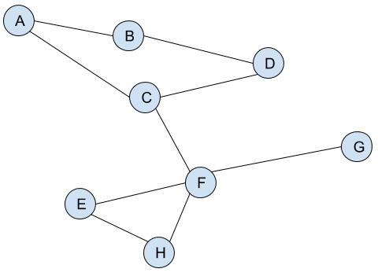

# Shortest Path across the Internet

For a computer network, it's useful to know how to get a packet from one
host to another across the Internet.

For this challenge, you will print out the shortest route from one host
to another on the console.

Even though we're using this to see how packets are routed on a network,
the exact same procedure could be used to:

* find how you're connected to a friend of a friend
* route an AI through a level
* etc.

## Map of the Internet

This is what is in the boilerplate:



## Modified BFS

Take your BFS code and modify it so that each neighbor gets a link back to its parent:

```pseudocode
BFS(graph, startVert):
  for v of graph.vertexes:
    v.color = white
    v.parent = null   // <-- Add parent initialization

  startVert.color = gray
  queue.enqueue(startVert)

  while !queue.isEmpty():
    u = queue[0]

    for v of u.neighbors:
      if v.color == white:
        v.color = gray
		v.parent = u     // <-- Keep a parent link
        queue.enqueue(v)
    
    queue.dequeue()
    u.color = black
```

## Algorithm

1. Perform a BFS from the ending vert (host).
2. Follow the parent pointers from starting vert printing the values as you go.


## Sample Run

```
$ node routing.js HostA HostD
HostA --> HostB --> HostD
$ node routing.js HostA HostH
HostA --> HostC --> HostF --> HostH
$ node routing.js HostA HostA
HostA
$ node routing.js HostE HostB
HostE --> HostF --> HostC --> HostA --> HostB
```